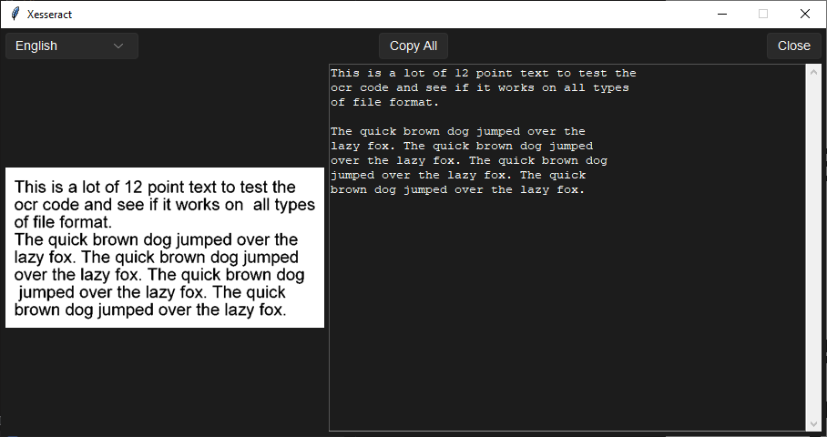

# Xesseract

Xesseract is a simple GUI application that uses Tesseract OCR to extract text from images. It supports multiple languages and provides an easy-to-use interface for copying the extracted text. Meant to be used with ShareX instead of its built-in OCR.

## Features

- Dark/light theme support
- Easy-to-modify
- Multi-language support

## Supported languages

List of OOTB languages:
- English
- Deutsch
- Español
- Français
- Italiano
- Polski
- Русский
- Українська

To add a language add [any language supported by Tesseract](https://tesseract-ocr.github.io/tessdoc/Data-Files-in-different-versions.html) to the `LANGUAGES` dict. 

Note: only the languages selected during the installation of Tesseract OCR will be available for use in Xesseract.

## Screenshots

  

## Installation

1. Clone the repository:
   ```bash
   git clone https://github.com/Alexander-Fen/Xesseract.git
   cd Xesseract

2. Prepare for the installation:
   ```bash
   pip install -r requirements.txt
   python sharex_gen.py
   ```

3. Add the application to [ShareX's Actions](https://getsharex.com/actions) with these parameters:
 - Name: `Xesseract`
 - File path: `C:\Windows\System32\cmd.exe`
 - Arguments: Generated by `sharex_gen.py`

## Requirements

- Python 3.7+
- Tesseract installed
- sv_ttk 
- Pillow (PIL)
- PyTesseract